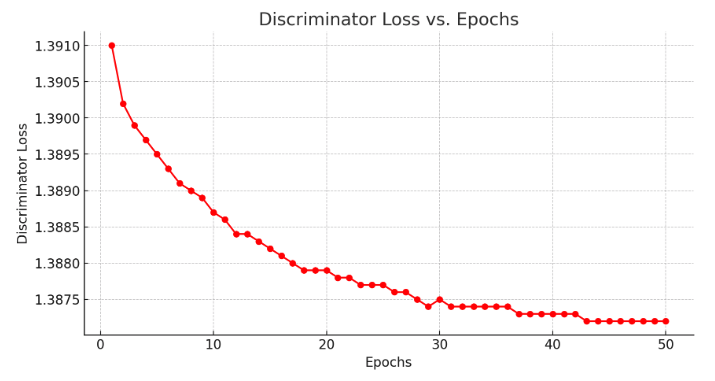

# RLassignment2

## Best Performance Award

DISCRIMINATOR_LR = 0.00005

DISCRIMINATOR_WD = 0.00005

POLICY_LR = 0.0001

LAMBDA_1 = 0.1

LAMBDA_2 = 0.1

EPOCH = 50

TASK = 'coffee'

VARIANCE = '0'    # D0 or D1

## Worst Performance Award (Best Humor Award)

DISCRIMINATOR_LR = 0.00005

DISCRIMINATOR_WD = 0.00005

POLICY_LR = 0.0001

LAMBDA_1 = 0.1

LAMBDA_2 = 0.3

EPOCH = 50

TASK = 'coffee'

VARIANCE = '1'    # D0 or D1

## Collaborators

Eason Ding

Chuhan Li

Fred Yang

We decided on using InfoGail together because of its capability in learning from visual demonstration (i.e. the agentview_image) and its robustness inherited from GAN-based frameworks. Eason is mainly responsible for developing the base architecture and validating the data pipeline. Since Chuhan and I have had 2 days extension, we had more time to test with different architectures and features. Chuhan is mainly responsible for developing and testing with different initialization methods and architectures. I am responsible for experimenting with different features and parameters. Note: this repo does not include the more complex architecture, since we have found that model complexity does not significantly affect task performance; please refer to Chuhan's repo for that checkpoint.) 

## Algorithm

InfoGail

InfoGail's adversarial structure that consists a generator and a discriminator would be especially powerful for learning from demonstration. InfoGail is also effective for learning from high-dimensional data such as visual input (i.e. agentview_image) because of the GAN-based architecture. The algorithm's use of latent variables allows the model to better handle the high-dimensional data and learning from various ways in completing a task.

## Parameters

1. Discriminator Learning Rate: This parameter controls the step size of the discriminator loss. Since the demonstrations are nearly optimal, the discriminator loss will already be around minimum if learning rate is initialized appropriately. Tuning this parameter does not significantly bring benefit to the model's performance.
2. $\lambda_2$ (Weight of Mutual Information in the Objective Function): This parameter influence the weight of the mutual information in the objective function. Mutual information indicates the information shared between the latent variables and the observations. A lower $\lambda_2$ will make the model to be more aligned with the expert demonstrations, so hypothetically D1 would require a slightly higher $\lambda_2$ to enable generalization but after some tunings the model's generalization ability is still not very ideal with high-variance D1 dataset.
3. Epoch: Though there is no golden rule for determine the number of epochs, experiments have shown that model will converge after around 50 epochs. Not enough epochs will result in robot behaviors that do not resemble the expert demonstration.

## Variance and Size

1. D0 vs. D1: The algorithm would perform better on D0 dataset because of its low-variance nature. Practical results have also confirmed the hypothesis.
2. Dataset size: Experiments have shown that 100 demonstrations are already enough to train with low-variance D0 dataset, but the results for high-variance D1 dataset has not been ideal. Thus, it is suspected that a greater number of demonstration is required for D1 datasets.

## Modification

The algorithm implemented is a simplified version of InfoGail. Instead of TRPO, only variations of Adam is used as optimization. We have also experimented with a more complex discriminator with self-attention and initialization called Kaiming's initialization, but tests have shown that they do not significantly improve the model's performance thus is not included in the checkpoint in this repo.

## Result

We have found that 1.3872 is about the best that the discriminator loss can achieve; ~0.06 is about the best that the generator loss can achieve. However, since our policy loss during training is calculated by MSE and BCE, evaluation with just MSE is not as informative on how the model performs.

### Training

We have found that 1.3872 is about the best that the discriminator loss can achieve; ~0.06 is about the best that the generator loss can achieve. Experiments have also shown that if policy loss is around ~0.08, the performance would be significantly worse.

### Evaluation
Average MSE Loss: 0.0267: 100%|██████████| 100/100 [00:06<00:00, 16.55it/s]

## Result vs. Hypothesis

Our hypothesis is that if we have included more features related to joint angles and eef position/orientation, the model would perform better since they contain explicit information about the robot's state. Results have confirmed that adding these features greatly aids to the generator. However, we have also assumed that adding "robot0_eye_in_hand_image" would also benefit the model since the robot has a hard time locating the cube to stack on, but results have shown that this feature would mess up the improved performance.
